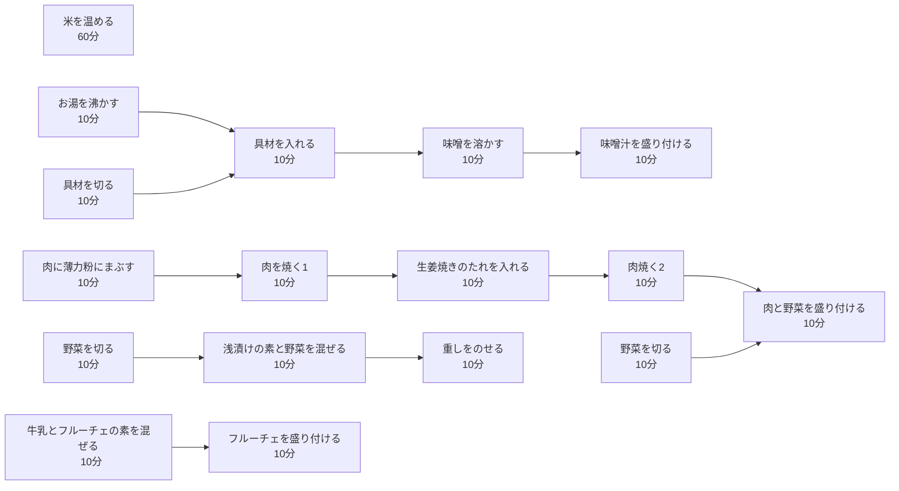

```mermaid
flowchart LR;

  kome_tin["米を温める
  60分"]
  misosiru_boil["お湯を沸かす
  10分"]
  misosiru_cut["具材を切る
  10分"]
  misosiru_in["具材を入れる
  10分"]
  misosiru_miso["味噌を溶かす
  10分"]
  misosiru_kansei["味噌汁を盛り付ける
  10分"]
  syouga_haku["肉に薄力粉にまぶす
  10分"]
  syouga_bake["肉を焼く1
  10分"]
  syouga_cut["野菜を切る
  10分"]
  syouga_in["生姜焼きのたれを入れる
  10分"]
  syouga_bake2["肉焼く2
  10分"]
  syouga_kansei["肉と野菜を盛り付ける
  10分"]
  tukemono_cut["野菜を切る
  10分"]
  tukemono_mix["浅漬けの素と野菜を混ぜる
  10分"]
  tukemono_atu["重しをのせる
  10分"]
  dezato_mix["牛乳とフルーチェの素を混ぜる
  10分"]
  dezato_kansei["フルーチェを盛り付ける
  10分"]

  tukemono_cut-->tukemono_mix
  tukemono_mix-->tukemono_atu
  dezato_mix-->dezato_kansei
  misosiru_boil-->misosiru_in
  misosiru_cut-->misosiru_in
  misosiru_in-->misosiru_miso
  misosiru_miso-->misosiru_kansei
  syouga_haku-->syouga_bake
  syouga_bake-->syouga_in
  syouga_in-->syouga_bake2
  syouga_bake2-->syouga_kansei
  syouga_cut-->syouga_kansei

```