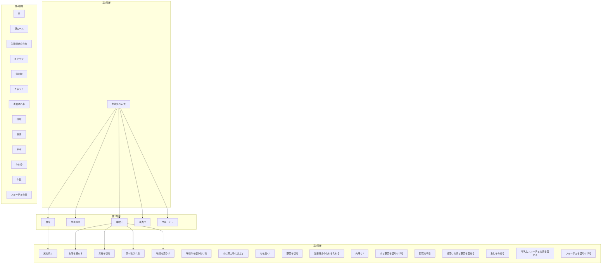

```mermaid

flowchart TB

subgraph "第1階層"

    teisyoku["生姜焼き定食"]

end

subgraph "第2階層"
    kome["白米"]

    syouga["生姜焼き"]

    misosiru["味噌汁"]

    tukemono["浅漬け"]

    dezato["フルーチェ"]


end


subgraph "第3階層"

    kome_tin["米を炊く"]

    misosiru_boil["お湯を沸かす"]

    misosiru_cut["具材を切る"]

    misosiru_in["具材を入れる"]

    misosiru_miso["味噌を溶かす"]

    misosiru_end["味噌汁を盛り付ける"]

    syouga_haku["肉に薄力粉にまぶす"]

    syouga_bake["肉を焼く1"]

    syouga_cut["野菜を切る"]

    syouga_in["生姜焼きのたれを入れる"]

    syouga_bake2["肉焼く2"]

    syouga_end["肉と野菜を盛り付ける"]

    tukemono_cut["野菜を切る"]

    tukemono_mix["浅漬けの素と野菜を混ぜる"]

    tukemono_atu["重しをのせる"]

    dezato_mix["牛乳とフルーチェの素を混ぜる"]

    dezato_end["フルーチェを盛り付ける"]

end

subgraph "第4階層"

    hakumai["米"]

    buta["豚ロース"]

    tare["生姜焼きのたれ"]

    kyabetu["キャベツ"]

    hakuriki["薄力粉"]

    kyuuri["きゅうり"]

    asaduke["浅漬けの素"]

    miso["味噌"]

    touhu["豆腐"]

    negi["ネギ"]

    wakame["わかめ"]

    gyunyu["牛乳"]

    huruche["フルーチェの素"]


end


%% 第1階層から第2階層へ
teisyoku-->kome
teisyoku-->syouga
teisyoku-->misosiru
teisyoku-->tukemono
teisyoku-->dezato


%% 第2階層から第3階層へ
kome--->kome_tin

misosiru--->misosiru_boil
misosiru--->misosiru_cut
misosiru--->misosiru_in
misosiru--->misosiru_miso


 
```


```